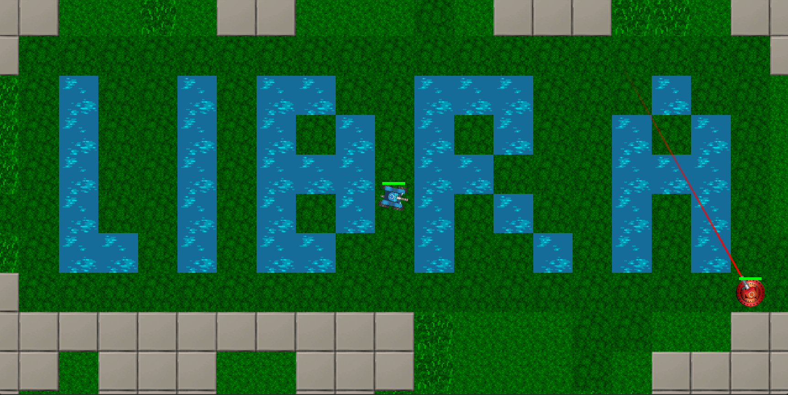

# Libra

<p align="center">
  
</p>

<p align="center">
  <strong>2D Twin-Stick Shooter | Custom C++ Engine | DirectX 11</strong>
</p>

## Overview

Libra is a 2D twin-stick shooter built entirely within my custom C++ game engine.

Players battle through hostile environments using multiple weapon types while navigating enemy encounters, environmental hazards, and progressively challenging levels. The project was developed to explore gameplay programming, AI systems, rendering architecture, particle effects, and engine development from the ground up.

Every major system, including rendering, input, audio, debugging tools, and gameplay logic, was built as part of my custom engine.

---

## Technologies

* C++
* DirectX 11
* Custom Game Engine
* XML Data-Driven Content
* Custom Math Library
* Sprite Rendering
* Audio Systems

---

## Running the Project

### Launch Prebuilt Executable

```text
Run/Libra_Release_x64.exe
```

### Build From Source

1. Open `Libra.sln` in Visual Studio 2022.

2. Configure debugger settings:

```text
Command:           $(TargetFileName)
Working Directory: $(SolutionDir)Run/
```

3. Build the solution:

```text
Ctrl + Shift + B
```

4. Run the project:

```text
F5
```

Recommended build configurations:

* Release
* Fast_Break

---

## Controls

### Gameplay

| Key   | Action        |
| ----- | ------------- |
| WASD  | Move          |
| IJKL  | Rotate Turret |
| Space | Fire Weapon   |
| R     | Toggle Weapon |
| P     | Start / Pause |
| Esc   | Back / Quit   |
| N     | Respawn       |

### Debug Controls

| Key | Action                   |
| --- | ------------------------ |
| T   | Slow Time (10%)          |
| Y   | Speed Up Time            |
| O   | Step One Frame           |
| F1  | Toggle Debug Drawing     |
| F2  | Invincibility Mode       |
| F3  | No Clip Mode             |
| F4  | Show Entire Map          |
| F6  | Cycle Distance Maps      |
| F7  | Tile Debug Information   |
| F8  | Restart Game             |
| F9  | Next Map                 |
| ~   | Toggle Developer Console |

### Developer Console

| Key | Action              |
| --- | ------------------- |
| 1   | Toggle Console Size |
| 2   | Print Test Error    |
| 3   | Print Test Warning  |
| 4   | Print Test Event    |
| 5   | Execute Last Event  |

### Xbox Controller

| Input         | Action                  |
| ------------- | ----------------------- |
| Right Stick   | Move                    |
| Left Stick    | Aim                     |
| Right Trigger | Fire Weapon             |
| Right Bumper  | Toggle Weapon           |
| Start         | Start / Pause / Respawn |
| B             | Back / Quit             |

---

## Key Features

### Twin-Stick Shooter Gameplay

* Responsive player movement and aiming
* Mouse and controller support
* Multiple weapon types
* Fast-paced combat encounters

### Weapon Systems

* Machine Gun
* Flamethrower
* Runtime weapon switching
* Distinct combat behaviors

### Enemy Systems

* Enemy AI behaviors
* Dynamic encounters
* Combat interactions
* Damage and health systems

### Engine Features

* Custom rendering pipeline
* Sprite and animation systems
* Audio playback and management
* Event-driven architecture
* Developer console

### Debugging Tools

* Invincibility mode
* No clip mode
* Distance map visualization
* Tile debugging
* Developer commands
* Frame stepping
